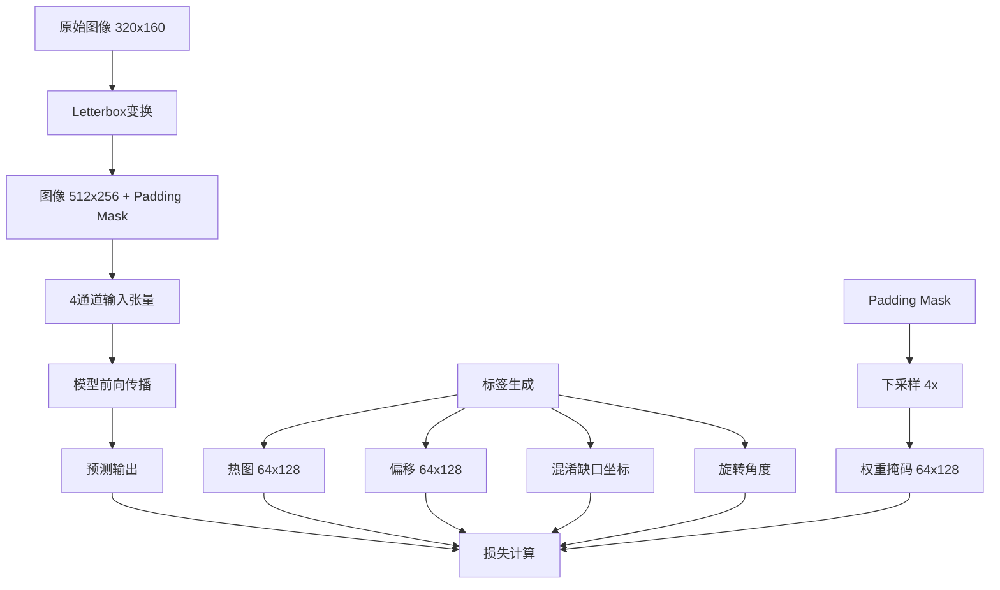

# Lite-HRNet-18 网络架构设计说明书 - 损失函数

## 0️⃣ 记号与标签生成（统一规范）

### 基础定义
- **原图大小**：`H×W = 256×512`
- **主特征图**：`H_f ∈ [B,128,64,128]`（**1/4 分辨率**）
- **真实中心（原图像素）**：
  - Gap缺口：`(x_g, y_g)`
  - Piece滑块：`(x_p, y_p)`

### 坐标映射
映射到1/4栅格坐标：
```
(u_g, v_g) = (x_g/4, y_g/4)  # gap栅格坐标  
(u_p, v_p) = (x_p/4, y_p/4)  # piece栅格坐标
```

### 假缺口定义
来自生成器的混淆缺口：
```
{(u_k, v_k)}_{k=1}^K, K=1..3  # 1-3个假缺口
```

### 高斯热图标签
使用栅格单位的σ生成热图：
```
Y(i,j) = exp(−((i−v)² + (j−u)²)/(2σ²))
```
推荐参数：`σ=1.5`

### 子像素偏移标签
就地监督的连续偏移：
```
δu = u − ⌊u⌋ ∈ [0,1)
δv = v − ⌊v⌋ ∈ [0,1)
```
训练时回归到`[−0.5, 0.5]`范围

### Padding Mask与权重掩码处理

#### 4通道输入结构
模型接收4通道输入张量 `[B, 4, H, W]`：
- **前3通道**：RGB图像（归一化到[0,1]）
- **第4通道**：Padding mask（1=有效区域，0=padding区域）

#### 权重掩码生成
```python
# 从输入第4通道提取并下采样
padding_mask = input[:, 3, :, :]  # [B, H, W]
weight_mask = AvgPool2d(k=4, s=4)(padding_mask)  # [B, H/4, W/4]
```

#### 实际实现细节
1. **数据预处理阶段**：
   - Letterbox变换生成padding mask
   - 将padding mask作为第4通道存储在图像NPY文件中
   - 不再单独保存weights.npy文件

2. **数据加载阶段**：
   - 从images.npy的第4通道提取padding mask
   - 使用平均池化下采样到1/4分辨率
   - 生成权重掩码供损失计算使用

> **核心原则**：所有1/4分辨率上的像素级损失逐像素乘权重掩码并按有效像素数归一化。

---

## 1️⃣ 热力图损失：CenterNet-style Focal（双中心）

### 作用
让`H_gap`与`H_piece`在真实中心处形成尖峰、背景更干净。

### 预测
```
H_gap, H_piece ∈ (0,1)^[B,1,64,128]  # Sigmoid激活
```

### Focal基本式
对gap/piece各算一次再相加，推荐`α=1.5, β=4, t_pos=0.9`：

```python
L_heat(P,Y) = -1/N_pos * Σ_{i,j} {
    (1-P_ij)^α * log(P_ij)           if Y_ij ≥ t_pos  
    (1-Y_ij)^β * P_ij^α * log(1-P_ij)  otherwise
}
```

### 屏蔽归一化
替代`1/N_pos`与`(1-M_pad/4)`：

```python
L_heat = Σ_{i,j}(L_focal(P,Y)_ij * W_1/4,ij) / (Σ_{i,j}W_1/4,ij + ε)
```

---

## 2️⃣ 子像素偏移损失：Smooth-L1（正样本内）

### 作用
回归每个中心在其栅格内的连续偏移，实现亚像素定位。

### 预测张量
```
O = [B,4,64,128]  # 四通道分别是 (du_g, dv_g, du_p, dv_p)
```
网络输出通过 `tanh × 0.5` 映射到 `[−0.5, 0.5]`

### 读取对应单点预测
按batch第b个样本：
- Gap: `d̂_x(g) = O[b,0,:,:]`, `d̂_y(g) = O[b,1,:,:]`
- Piece: `d̂_x(p) = O[b,2,:,:]`, `d̂_y(p) = O[b,3,:,:]`

### 标签
```
(δu_g - 0.5, δv_g - 0.5)  # Gap偏移
(δu_p - 0.5, δv_p - 0.5)  # Piece偏移
```

### 损失计算
单样本Smooth-L1（Huber）：
```
l_off(g) = SmoothL1(d̂_x(g) - d*_x(g)) + SmoothL1(d̂_y(g) - d*_y(g))
l_off(p) = SmoothL1(d̂_x(p) - d*_x(p)) + SmoothL1(d̂_y(p) - d*_y(p))
```

### 加权归一化
使用热图值作为权重：
```
L_off = Σ(w_g * l_off(g)) / Σw_g + Σ(w_p * l_off(p)) / Σw_p
```
其中 w_g 和 w_p 分别是gap和piece的热图值

**注意**：不使用epsilon，而是通过assert检查确保权重和不为零

---

## 3️⃣ 假缺口抑制（Hard-Negative）：Margin Ranking  

### 作用
显式压制1–3个confusing_gap的次峰。

### 分数取值（任选其一，更稳）

1. **双线性采样**：
```
s^+ = bilinear(H_gap, u_g, v_g)
s_k^- = bilinear(H_gap, u_k, v_k)
```

2. **邻域最大**：在各坐标3×3邻域取最大

且只在有效区采样（要求`W_1/4(v,u) > 0`）。

### 损失
```
L_hn = 1/K * Σ_{k=1}^K max(0, m - s^+ + s_k^-)
```
其中`m = 0.2 ~ 0.3`

---

## 4️⃣ 角度损失（微角度，可选）

### 作用
建模0.5–1.8°的微旋，抑制"形似但角度偏"的假峰。

### 预测
```
θ = [B,2,64,128]  # L2归一化后表示(sin̂θ, coŝθ)
```

### 标签
```
(sinθ_g, cosθ_g)  # 来自合成器
```

### 仅在gap中心邻域监督
```
M_ang = 1(Y_gap > 0.7)
```

### 屏蔽归一化
```
L_ang = Σ[1 - (sin̂θ*sinθ_g + coŝθ*cosθ_g)] * M_ang * W_1/4 / Σ(M_ang*W_1/4)+ε
```

---

## 5️⃣ 滑块和背景缺口不同y轴损失

### 0) 前置（两张热力图 → 行分布）

$s_g(y)=\frac{1}{W_s}\sum_x H_g(y,x)$,
$s_p(y)=\tfrac{1}{W_s}\sum_x H_p(y,x)$
$p_g(y)=\frac{e^{s_g(y)/\tau}}{\sum_t e^{s_g(t)/\tau}}$,
$p_p(y)=\frac{e^{s_p(y)/\tau}}{\sum_t e^{s_p(t)/\tau}}$

建议 $τ=1.0$ ；若多峰跳动，试 0.8。若有上下 padding 行，先把对应 $s(⋅)$ 置为 $−∞$。

$\mathcal{L}_{\text{rowCE}}=-logp_g(y)p_p(y)$

### 1) 一维 Wasserstein-1 / EMD

$F_g​(y)=∑​^{y}_{t=0}p_g​(t),F_p​(y)=∑^y_{t=0}​p_p​(t)$

$\mathcal{L}_{EMD}=\frac{1}{H_s}\sum_{y=0}^{H_s-1}\lvert{F_g(y)-F_p(y)}\lvert$

这里 $H_s=64$（1/4 尺度的行数）。

### 2)总不同y轴损失

$\mathcal{L}_y=\lambda_{row}\mathcal{L}_{\text{rowCE}}+\lambda_{dist}\mathcal{L}_{\text{KL-sym}}$

**推荐权重**：

$\lambda_{\text{row}}=1.0$

$\lambda_{\text{dist}}=0.2\sim0.5$


## 总损失组合

$$
L=w_h⋅(L_{heat}^{gap}+L_{heat}^{piece})+w_o⋅L_{off}+w_a⋅L_{ang}+w_{hn}·L_{hn}+\lambda_{row}\mathcal{L}_{\text{rowCE}}+\lambda_{dist}\mathcal{L}_{\text{KL-sym}}
$$

其中：
- `L_focal`：CenterNet风格热力图损失，α=1.5, β=4.0
- `L_offset`：子像素偏移损失，使用热图值加权
- `L_hard_negative`：Margin Ranking损失，抑制假缺口
- `L_angle`：角度损失，用于微旋转
- `L_rowCE`：行分类损失 Row‑CE，抑制模型预测出的滑块和缺口的y值不同行
- `L_KL-sym`：一维 Wasserstein-1 / EMD ，抑制错位/双峰造成的“假同行”。
- 权重：$$λ_{off}=1.0, λ_{hn}=0.5, λ_{ang}=0.5$$

---

## 6️⃣ 附加解释

### CenterNet风格的热力图Focal Loss

**核心思想**：
- 正样本（中心点）：当预测值低时施加更大惩罚
- 负样本（背景）：根据到中心的距离加权，越远权重越小
- 通过`α`和`β`控制难易样本的关注度

**数学原理**：
- `(1-P)^α`项：当P接近0时损失更大，聚焦困难正样本
- `(1-Y)^β`项：距离权重，远离中心的负样本获得更小权重
- 避免简单负样本主导训练

### 子像素偏移损失（Smooth L1）

**为什么需要子像素**：
- 热力图分辨率为1/4，定位精度受限于栅格大小
- 子像素偏移补偿量化误差，实现亚像素精度
- 将离散坐标转换为连续坐标，提升定位精度至1像素级别

**Smooth L1优势**：
- 对异常值不敏感（相比L2）
- 梯度连续，训练稳定
- 在误差小时表现为L2（平滑），误差大时表现为L1（鲁棒）

### 形态学梯度

**边界提取原理**：
```
Edge = Dilation(M) - Erosion(M)
```
- 膨胀操作扩大前景区域
- 腐蚀操作缩小前景区域
- 两者之差即为边界

**为什么先下采样**：
- 直接在高分辨率提取边界会导致细边消失
- 先下采样保证边界宽度与特征图尺度匹配

### Margin Ranking假缺口抑制

**动机**：
- 混淆缺口在视觉上与真实缺口相似
- 仅靠Focal Loss难以完全抑制假峰
- 需要显式的对比学习机制

**Margin设计**：
- `m=0.2~0.3`提供足够的决策边界
- 强制真实缺口分数比假缺口高至少m
- 类似于人脸识别中的Triplet Loss思想

---

## 7️⃣ 实现细节与最佳实践

### 训练技巧

1. **预热学习率**
```python
# 前5个epoch线性预热
if epoch < 5:
    lr = base_lr * (epoch + 1) / 5
```

2. **多尺度训练**
```python
# 随机选择输入尺度
scales = [0.8, 1.0, 1.2]
scale = random.choice(scales)
input = F.interpolate(input, scale_factor=scale)
```

3. **数据增强顺序**
- 先几何变换（旋转、缩放）
- 后颜色变换（亮度、对比度）
- 最后应用噪声（柏林噪声等）

### 推理优化

1. **TTA（测试时增强）**
```python
# 多尺度测试取平均
predictions = []
for scale in [0.9, 1.0, 1.1]:
    pred = model(F.interpolate(input, scale_factor=scale))
    predictions.append(pred)
final_pred = torch.mean(torch.stack(predictions), dim=0)
```

2. **后处理NMS**
```python
# 非极大值抑制去除重复检测
def nms_heatmap(heatmap, kernel_size=3):
    max_pool = F.max_pool2d(heatmap, kernel_size, stride=1, padding=1)
    peak_mask = (heatmap == max_pool)
    return heatmap * peak_mask
```

### 调试可视化

```python
# TensorBoard监控
writer.add_scalar('Loss/heat', L_heat, step)
writer.add_scalar('Loss/offset', L_off, step)
writer.add_scalar('Loss/hard_negative', L_hn, step)
writer.add_image('Heatmap/gap', H_gap[0], step)
writer.add_image('Heatmap/piece', H_piece[0], step)
```

---

## 8️⃣ 代码实现说明

### 数据处理流水线

#### 预处理流程
```python
# src/preprocessing/preprocessor.py
class TrainingPreprocessor:
    def preprocess(self, image, gap_center, slider_center, confusing_gaps, gap_angle):
        # 1. Letterbox变换
        image_letterboxed, transform_params = self.letterbox.apply(image)
        
        # 2. 生成padding mask
        padding_mask = self.letterbox.create_padding_mask(transform_params)
        
        # 3. 组合4通道输入
        input_tensor = np.concatenate([
            image_channels,                    # [3, H, W]
            padding_mask[np.newaxis, :, :]    # [1, H, W]
        ], axis=0)  # [4, H, W]
        
        # 4. 生成热图和偏移标签
        # ...
        
        return {
            'input': input_tensor,  # 4通道
            'heatmaps': heatmaps,
            'offsets': offsets,
            'confusing_gaps': confusing_grids,
            'gap_angle': np.radians(gap_angle)
        }
```

#### 数据集生成
```python
# src/preprocessing/dataset_generator.py
class StreamingDatasetGenerator:
    def _flush_buffer_to_disk(self, split):
        # 保存数据文件
        np.save(image_path, self._buf_images[:batch_size])     # 4通道图像
        np.save(heatmap_path, self._buf_heatmaps[:batch_size])
        np.save(offset_path, self._buf_offsets[:batch_size])
        # 注意：权重掩码已集成在第4通道，不再单独保存
```

#### 数据加载
```python
# src/training/npy_data_loader.py
class NPYBatchDataset:
    def __getitem__(self, idx):
        # 加载4通道图像
        images = np.load(image_path)  # [B, 4, 256, 512]
        
        # 从第4通道提取权重掩码
        padding_mask = images[:, 3, :, :]  # [B, 256, 512]
        
        # 下采样到1/4分辨率
        weights = downsample_by_avgpool(padding_mask, factor=4)  # [B, 64, 128]
        
        return {
            'image': images,  # 包含padding mask的4通道
            'weight_gap': weights,
            'weight_slider': weights,
            # ...
        }
```

### 损失函数模块结构
```
src/models/loss_calculation/
├── focal_loss.py       # CenterNet风格热力图损失
├── offset_loss.py      # 子像素偏移损失
├── hard_negative_loss.py  # 假缺口抑制损失
├── angle_loss.py       # 角度损失
├── total_loss.py       # 总损失组合
└── config_loader.py    # 配置加载器
```

### 配置文件
```yaml
# config/loss.yaml
focal_loss:
  alpha: 1.5          # 正样本聚焦参数
  beta: 4.0           # 负样本距离加权
  pos_threshold: 0.8  # 正样本阈值
  eps: 1.0e-8        # 数值稳定性


offset_loss:
  beta: 1.0           # Smooth L1平滑参数


hard_negative_loss:
  margin: 0.2         # 真假缺口最小得分差
  score_type: bilinear  # 采样方式
  neighborhood_size: 3  # 邻域大小
```

### 关键实现细节

1. **Focal Loss归一化**：使用N_pos（正样本数）进行归一化，避免样本不平衡
2. **Offset Loss加权**：直接使用热图值作为权重w_g，无需额外阈值
3. **Hard Negative采样**：支持双线性插值和邻域最大值两种方式
4. **工厂函数**：所有损失函数都提供工厂函数，不使用默认参数

---

## 9️⃣ 数据流与损失计算完整流程

### 训练数据流



### 损失计算详细步骤

#### Step 1: 准备阶段
```python
# 从批次数据中提取
images = batch['image']           # [B, 4, 256, 512]
heatmap_gap_gt = batch['heatmap_gap']     # [B, 64, 128]
heatmap_slider_gt = batch['heatmap_slider']  # [B, 64, 128]
offset_gap_gt = batch['offset_gap']       # [B, 2, 64, 128]
offset_slider_gt = batch['offset_slider']    # [B, 2, 64, 128]
weight_mask = batch['weight_gap']         # [B, 64, 128]
confusing_gaps = batch['confusing_gaps']     # List[List[Tuple]]
gap_angles = batch['gap_angles']          # [B]
```

#### Step 2: 模型预测
```python
# 模型输出
outputs = model(images)  # 4通道输入
heatmap_gap_pred = outputs['heatmap_gap']     # [B, 1, 64, 128]
heatmap_slider_pred = outputs['heatmap_slider']  # [B, 1, 64, 128]
offset_gap_pred = outputs['offset_gap']       # [B, 2, 64, 128]
offset_slider_pred = outputs['offset_slider']    # [B, 2, 64, 128]
angle_pred = outputs.get('angle')          # [B, 2, 64, 128] (可选)
```

#### Step 3: 损失组件计算
```python
# 1. Focal Loss（热图损失）
L_focal_gap = focal_loss(heatmap_gap_pred, heatmap_gap_gt, weight_mask)
L_focal_slider = focal_loss(heatmap_slider_pred, heatmap_slider_gt, weight_mask)

# 2. Offset Loss（偏移损失）
L_offset_gap = offset_loss(offset_gap_pred, offset_gap_gt, heatmap_gap_gt, weight_mask)
L_offset_slider = offset_loss(offset_slider_pred, offset_slider_gt, heatmap_slider_gt, weight_mask)

# 3. Hard Negative Loss（假缺口抑制）
if confusing_gaps:
    L_hard_negative = hard_negative_loss(heatmap_gap_pred, gap_coords_gt, confusing_gaps, weight_mask)
else:
    L_hard_negative = 0

# 4. Angle Loss（角度损失）
if angle_pred is not None and gap_angles is not None:
    L_angle = angle_loss(angle_pred, gap_angles, heatmap_gap_gt, weight_mask)
else:
    L_angle = 0
```

#### Step 4: 总损失组合
```python
L_total = (L_focal_gap + L_focal_slider) * weights['heatmap'] + \
          (L_offset_gap + L_offset_slider) * weights['offset'] + \
          L_hard_negative * weights['hard_negative'] + \
          L_angle * weights['angle']
```

### 关键数据转换

| 阶段 | 数据格式 | 维度 | 说明 |
|------|---------|------|------|
| 原始图像 | uint8 | [320, 160, 3] | RGB图像 |
| Letterbox后 | float32 | [256, 512, 3] | 归一化+填充 |
| 4通道输入 | float32 | [4, 256, 512] | RGB+Mask |
| 特征图 | float32 | [C, 64, 128] | 1/4分辨率 |
| 热图预测 | float32 | [1, 64, 128] | Sigmoid激活 |
| 偏移预测 | float32 | [2, 64, 128] | Tanh激活 |
| 权重掩码 | float32 | [64, 128] | 从第4通道下采样 |

### 内存优化策略

1. **流式数据生成**：使用缓冲区复用，避免内存累积
2. **NPY批量存储**：预处理数据保存为NPY格式，减少实时计算
3. **权重集成**：将权重掩码集成到输入第4通道，减少独立文件
4. **多进程加载**：使用DataLoader的多进程预取机制