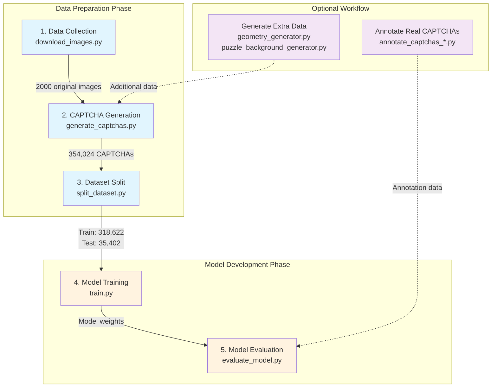

# Script Usage Guide

This directory contains the core functional scripts for the slider CAPTCHA recognition system, covering the complete workflow from data collection, CAPTCHA generation, model training, to inference and evaluation.

## 📁 Directory Structure

```
scripts/
├── download_images.py                     # Image download script
├── generate_captchas.py                   # Batch CAPTCHA generation script
├── split_dataset.py                       # Dataset splitting script
│
├── annotation/                            # 📝 Annotation tools
│   ├── annotate_captchas_matplotlib.py    # Matplotlib annotation interface
│   └── annotate_captchas_web.py           # Web annotation interface
│
├── data_generation/                       # 🎨 Data generation
│   ├── geometry_generator.py              # Geometric pattern generator
│   └── puzzle_background_generator.py     # Puzzle background generator
│
├── evaluation/                            # 📊 Model evaluation
│   └── evaluate_model.py                  # Comprehensive evaluation tool
│
├── inference/                             # 🚀 Model inference
│   └── predict.py                         # Prediction interface
│
└── training/                              # 🏋️ Model training
    ├── train.py                           # Training main script
    ├── dataset.py                         # PyTorch dataset class
    └── analyze_training.py                # Training analysis tool
```

## 📑 Table of Contents

1. [Data Preparation](#data-preparation)
   
   - [download_images.py](#download_imagespy)
   - [generate_captchas.py](#generate_captchaspy)
   - [split_dataset.py](#split_datasetpy)

2. [Annotation Tools](#annotation-tools)
   
   - [annotate_captchas_matplotlib.py](#annotate_captchas_matplotlibpy)
   - [annotate_captchas_web.py](#annotate_captchas_webpy)

3. [Data Generation](#data-generation)
   
   - [geometry_generator.py](#geometry_generatorpy)
   - [puzzle_background_generator.py](#puzzle_background_generatorpy)

4. [Model Training](#model-training)
   
   - [train.py](#trainpy)
   - [dataset.py](#datasetpy)
   - [analyze_training.py](#analyze_trainingpy)

5. [Model Inference](#model-inference)
   
   - [predict.py](#predictpy)

6. [Model Evaluation](#model-evaluation)
   
   - [evaluate_model.py](#evaluate_modelpy)

---

## 🔄 Complete Workflow



### Quick Start

```bash
# Step 1: Download original images (2000 images)
python scripts/download_images.py

# Step 2: Generate CAPTCHA dataset (354,024 images)
python scripts/generate_captchas.py

# Step 3: Split train/test sets (9:1)
python scripts/split_dataset.py

# Step 4: Train model
python scripts/training/train.py

# Step 5: Evaluate model performance
python scripts/evaluation/evaluate_model.py --mode all
```

---

## Data Preparation

### download_images.py

**Function**: Automatically download high-quality images from Pixabay API as background images for CAPTCHA generation.

**Usage Example**:

```bash
# Basic usage - Download all categories using default configuration
python scripts/download_images.py

# Note: The script automatically reads configuration from configs/config.yaml
# No command-line parameters needed, all settings are controlled through the config file
```

**Output Directory Structure**:

```
data/raw/
├── minecraft/          # 200 Minecraft style images
├── Pixel_Food/         # 200 pixel food images
├── Block_Public_Square/# 200 block public square images
├── backgrounds/        # 200 background images
├── buildings/          # 200 building images
├── nature/            # 200 nature landscape images
├── Anime_Cityscape/   # 200 anime cityscape images
├── Abstract_Geometric_Art/ # 200 abstract geometric art
└── ...                # Other categories
```

**Configuration** (controlled via config.yaml):

- **categories**: 10 preset image categories
- **images_per_category**: Number of downloads per category (default: 200)
- **concurrent_downloads**: Concurrent download count (default: 2, to avoid rate limits)
- **download_timeout**: Single image download timeout (default: 30 seconds)
- **max_retries**: Retry count on failure (default: 3)

**Log Files**:

- `logs/data_collection.log` - Detailed download logs including error information

**Notes**:

- Requires valid Pixabay API key (set in config.yaml)

### generate_captchas.py

**Function**: Batch generate slider CAPTCHA dataset, converting original images into CAPTCHA images with puzzle pieces and sliders, supporting multi-process parallel processing.

**Usage Example**:

```bash
# Basic usage - Process all original images
python scripts/generate_captchas.py

# Limit processing count (for testing)
python scripts/generate_captchas.py --max-images 10

# Specify worker process count
python scripts/generate_captchas.py --workers 4

# Process specific subdirectories only
python scripts/generate_captchas.py --subdirs minecraft nature

# Custom input/output paths
python scripts/generate_captchas.py --input-dir data/my_images --output-dir data/my_captchas
```

**Command-line Parameters**:

- `--input-dir`: Original image directory (default: data/raw)
- `--output-dir`: Output CAPTCHA directory (default: data/captchas)
- `--workers`: Worker process count (default: auto-detect, max 8)
- `--max-images`: Maximum images to process (default: process all)
- `--subdirs`: Subdirectories to process (default: process all)

**Generation Rules**:

- **Puzzle shapes**: 11 types (5 edge combinations + 6 special shapes)
- **Puzzle sizes**: 3 random sizes per image (40-70 pixels)
- **Puzzle positions**: 4 random positions, x-axis must be > 70px (slider width 60px + 10px)
- **Slider position**: x-coordinate 0-10px random, y-coordinate aligned with gap

**Output Files**:

- CAPTCHA images: `Pic{XXXX}_Bgx{X}Bgy{Y}_Sdx{X}Sdy{Y}_{hash}.png`
- Annotation file: `annotations.json` - Contains all CAPTCHA coordinate information
- Statistics file: `generation_stats.json` - Generation statistics and timing

**Performance**:

- 2000 original images generate ~264,000 CAPTCHAs (actually generates 354,024)
- Total output size ~1.5GB

### split_dataset.py

**Function**: Split generated CAPTCHA dataset by original image ID into training and test sets, ensuring all variants of the same original image stay in the same set to avoid data leakage.

**Usage Example**:

```bash
# Basic usage - 9:1 split, copy files
python scripts/split_dataset.py

# Custom split ratio (8:2)
python scripts/split_dataset.py --train-ratio 0.8

# Use move mode (faster but deletes original files)
python scripts/split_dataset.py --move

# Specify worker process count
python scripts/split_dataset.py --workers 16

# Custom paths
python scripts/split_dataset.py --captcha-dir data/my_captchas --train-dir data/my_train --test-dir data/my_test

# Set random seed (for reproducibility)
python scripts/split_dataset.py --seed 2024
```

**Command-line Parameters**:

- `--captcha-dir`: Source CAPTCHA directory (default: data/captchas)
- `--train-dir`: Training set output directory (default: data/train)
- `--test-dir`: Test set output directory (default: data/test)
- `--train-ratio`: Training set ratio (default: 0.9)
- `--seed`: Random seed (default: 42)
- `--move`: Move files instead of copying (recommended for large datasets)
- `--workers`: Worker process count (default: auto-detect)

**Output Files**:

- `data/train/` - Training set images and annotations.json
- `data/test/` - Test set images and annotations.json
- `data/dataset_split_stats.json` - Split statistics

**Data Leakage Check**:
The script automatically verifies that training and test sets have no overlapping Pic IDs, ensuring:

- All 132 variants of the same original image stay in the same set
- Fair and reliable model evaluation

---

## Annotation Tools

### annotation/annotate_captchas_matplotlib.py

**Function**: Matplotlib-based CAPTCHA annotation tool for manually annotating slider and gap positions in real CAPTCHAs, supporting use in Python environments like Spyder.

**Usage Example**:

```bash
# Basic usage - Annotate images in default directory
python scripts/annotation/annotate_captchas_matplotlib.py

# Specify input/output directories
python scripts/annotation/annotate_captchas_matplotlib.py --input data/my_captchas --output data/my_annotations

# Limit annotation count (default 100)
python scripts/annotation/annotate_captchas_matplotlib.py --max 50

# Complete example
python scripts/annotation/annotate_captchas_matplotlib.py \
    --input data/real_captchas/merged/site1 \
    --output data/real_captchas/annotated \
    --max 200
```

**Command-line Parameters**:

- `--input`: Input image directory (default: data/real_captchas/merged/site1)
- `--output`: Output annotation directory (default: data/real_captchas/annotated)
- `--max`: Maximum annotation count (default: 100)

**Operation Flow**:

1. Program displays image, waits for user clicks
2. First click: Mark slider center (red circle + S)
3. Second click: Mark gap center (blue circle + G)
4. Click Save to save and proceed to next
5. Click Skip to skip current image
6. Click Reset to clear current marks and restart

**Output Files**:

- Annotated images: `Pic{XXXX}_Bgx{X}Bgy{Y}_Sdx{X}Sdy{Y}_{hash}.png`
- Annotation file: `annotations.json` - Contains all annotation coordinate information

### annotation/annotate_captchas_web.py

**Function**: Flask-based web CAPTCHA annotation tool for annotation through browser interface, supporting keyboard shortcuts, better suited for large-scale annotation tasks.

**Usage Example**:

```bash
# Basic usage - Start web server
python scripts/annotation/annotate_captchas_web.py

# After starting, open http://localhost:5000 in browser

# Note: Need to modify path configuration in script first:
# INPUT_DIR = Path("../../data/real_captchas/merged/site1")
# OUTPUT_DIR = Path("../../data/real_captchas/annotated")
# MAX_IMAGES = 100
```

**Keyboard Shortcuts**:

- **Space**: Save and proceed to next (requires completed annotation)
- **R**: Reset current annotation
- **S**: Skip current image

**Operation Flow**:

1. Run script to start Flask server
2. Open http://localhost:5000 in browser
3. Click image to mark slider position (red)
4. Click again to mark gap position (blue)
5. Press space or click "Save & Next" to save
6. Repeat until all images complete

**Output Files**:

- Annotated images: `Pic{XXXX}_Bgx{X}Bgy{Y}_Sdx{X}Sdy{Y}_{hash}.png`
- Annotation file: `annotations.json`
- Download support: Visit `/download_annotations` to download JSON file

---

## Data Generation

### data_generation/geometry_generator.py

**Function**: Generate dense geometric pattern backgrounds to increase CAPTCHA dataset diversity and improve model's anti-confusion capability. Supports dark and white backgrounds, containing complex patterns with over 1500 geometric elements.

**Usage Example**:

```bash
# Generate single image and preview
python scripts/data_generation/geometry_generator.py --single

# Batch generate 200 images (default dark background)
python scripts/data_generation/geometry_generator.py

# Generate 100 white background images
python scripts/data_generation/geometry_generator.py --count 100 --white-bg

# Use 8 processes to generate 500 images
python scripts/data_generation/geometry_generator.py --count 500 --workers 8

# Sequential mode (for debugging or Windows issues)
python scripts/data_generation/geometry_generator.py --sequential

# Custom output directory
python scripts/data_generation/geometry_generator.py --output data/my_patterns
```

**Command-line Parameters**:

- `--count`: Number of images to generate (default: 200)
- `--output`: Output directory (default: data/raw/Geometric_Generated)
- `--single`: Generate single image and try to preview
- `--workers`: Worker process count (default: auto-detect)
- `--sequential`: Use sequential mode instead of multiprocessing
- `--white-bg`: Generate white background (default: dark background)

**Output Directories**:

- Dark background: `data/raw/Geometric_Generated/`
- White background: `data/raw/Geometric_Generated_white/`

**Pattern Composition**:

1. **Bezier network**: Connection network of 60 nodes
2. **Spirals**: 35 spirals of different sizes
3. **Large shapes**: 55 as background layer
4. **Medium shapes**: 8×6 grid, 3-5 per cell
5. **Small shapes**: 300 to fill gaps
6. **Tiny decorations**: 800 dot elements

**Performance**:

- Single image generation time: ~1 second (AMD 9950X)

### data_generation/puzzle_background_generator.py

**Function**: Generate white background complex puzzle pattern backgrounds to increase CAPTCHA dataset diversity and improve model's anti-confusion capability. Uses 81 standard puzzle shapes and 12 special shapes combination with realistic lighting effects.

**Core Features**:

- Generate 320×160 resolution puzzle background patterns
- 81 standard puzzle edge combinations + 12 special shapes (circle, heart, star, moon, etc.)
- Smart placement algorithm ensuring no overlap between puzzle pieces
- Realistic 3D lighting effects (gap shadows, slider highlights)
- Multi-size puzzle pieces (15-70 pixels) dynamic combination

**Usage Example**:

```bash
# Preview single effect
python scripts/data_generation/puzzle_background_generator.py --preview

# Batch generate 400 images (default)
python scripts/data_generation/puzzle_background_generator.py

# Generate 200 images using 8 processes
python scripts/data_generation/puzzle_background_generator.py --count 200 --workers 8

# Custom output directory
python scripts/data_generation/puzzle_background_generator.py --output data/my_puzzles

# Sequential mode for Windows (avoid multiprocessing issues)
python scripts/data_generation/puzzle_background_generator.py --workers 1
```

**Command-line Parameters**:

- `--count`: Number of images to generate (default: 400)
- `--output`: Output directory (default: data/raw/Puzzle_Backgrounds)
- `--workers`: Worker process count (default: auto-detect)
- `--preview`: Generate and preview single image

**Output Files**:

- Filename format: `puzzle_bg_{XXXX}_{timestamp}.png`
- Output directory: `data/raw/Puzzle_Backgrounds/`

**Puzzle Composition**:

1. **Initial large shapes**: 12-18 large size puzzles (55-70px) as foundation
2. **Medium filling**: Dynamically select medium sizes (35-55px) to fill main space
3. **Detail filling**: Small size puzzles (15-35px) to fill remaining gaps
4. **Lighting effects**:
   - Slider effect: Edge highlight (60-100), directional highlight (30-50)
   - Gap effect: Base shadow (30), edge shadow (50), directional shadow (25)

---

## Model Training

### training/train.py

**Function**: Main training script for slider CAPTCHA detection model, implementing complete training workflow based on CenterNet architecture, supporting distributed training, mixed precision training, and resource monitoring.

**Usage Example**:

```bash
# Train with default configuration
python scripts/training/train.py

# Use custom configuration file
python scripts/training/train.py --config configs/my_train_config.yaml

# Resume training from checkpoint
python scripts/training/train.py --resume checkpoints/latest_checkpoint.pth

# Recommended settings for Windows (avoid shared memory issues)
python scripts/training/train.py --config configs/train_config_windows.yaml
```

**Configuration File Parameters**:
Training configuration files are created in `configs/` directory:
- `configs/train_config.yaml` - Standard configuration file
- `configs/train_config_windows.yaml` - Windows optimized configuration

```yaml
# configs/train_config.yaml example
data_dir: data                    # Data directory
output_dir: checkpoints          # Output directory
batch_size: 512                  # Batch size (256 recommended for Windows)
num_workers: 12                  # Data loading processes (4-8 recommended for Windows)
epochs: 20                       # Training epochs
lr: 0.001                        # Initial learning rate
weight_decay: 0.0001            # Weight decay
reg_weight: 1.0                 # Offset loss weight
gaussian_radius: 3              # Gaussian kernel radius
pretrained_weights: null        # Pretrained weights path (optional)
```

**Output Files**:

- `checkpoints/latest_checkpoint.pth` - Latest checkpoint
- `checkpoints/best_model.pth` - Best model
- `checkpoints/checkpoint_epoch_XXXX.pth` - Per-epoch checkpoint
- `checkpoints/logs/` - TensorBoard logs
- `checkpoints/training_log_YYYYMMDD_HHMMSS.txt` - Training log

**Training Process**:

1. **Data preprocessing**: Image normalization, data augmentation (brightness/contrast/noise/blur)
2. **Heatmap generation**: Generate peaks at target centers using Gaussian kernels
3. **Loss calculation**:
   - Focal Loss (α=2, β=4) for heatmaps
   - L1 Loss for offset regression
4. **Optimization strategy**:
   - AdamW optimizer
   - OneCycleLR scheduler (10% warmup, cosine annealing)
   - Gradient clipping (max_norm=1.0)

**Monitoring Metrics**:

- Train/validation loss (total loss, heatmap loss, regression loss)
- MAE (Mean Absolute Error in pixels)
- Learning rate changes
- GPU utilization, memory usage, power consumption
- CPU and memory usage

**Performance Reference**:

- ~6 minutes/epoch (batch_size=512) (RTX 5090)
- 20 epochs total training time: 1-2 hours (RTX 5090)

### training/dataset.py

**Function**: PyTorch dataset class for loading and preprocessing slider CAPTCHA data. Designed as standalone module to solve Windows multiprocessing pickle issues.

**Usage Example**:

```python
from dataset import OptimizedCaptchaDataset
import albumentations as A
from albumentations.pytorch import ToTensorV2

# Define data augmentation
transform = A.Compose([
    A.RandomBrightnessContrast(p=0.5),
    A.GaussNoise(p=0.3),
    A.Normalize(mean=[0.485, 0.456, 0.406], std=[0.229, 0.224, 0.225]),
    ToTensorV2()
])

# Create dataset
dataset = OptimizedCaptchaDataset(
    data_dir='data',
    annotations_file='data/train/annotations.json',
    split='train',
    transform=transform
)

# Use in DataLoader
from torch.utils.data import DataLoader
dataloader = DataLoader(
    dataset, 
    batch_size=32, 
    shuffle=True, 
    num_workers=4
)
```

**Data Format Requirements**:
annotations.json format:

```json
[
  {
    "filename": "Pic0001_Bgx120Bgy70_Sdx30Sdy70_hash.png",
    "bg_center": [120, 70],      // Gap center coordinates
    "sd_center": [30, 70],       // Slider center coordinates
    "shape": "puzzle_0012",      // Shape type
    "size": 60                   // Puzzle size
  }
]
```

**Return Data Format**:

```python
{
    'image': tensor,           # Image tensor (C, H, W)
    'bg_center': array,       # Gap center [x, y]
    'slider_center': array,   # Slider center [x, y]
    'filename': str          # Filename
}
```

### training/analyze_training.py

**Function**: Analyze training logs, extract key metrics and visualize training process to help find optimal model checkpoints.

**Usage Example**:

```bash
# Analyze training logs in default checkpoints directory
python scripts/training/analyze_training.py

# Analyze training logs in specified directory
python scripts/training/analyze_training.py --checkpoint_dir path/to/checkpoints
```

**Log Parsing Features**:

- Supports standard format training logs (training_log_*.txt)
- Extracts information:
  - Training epochs
  - Training loss
  - Validation loss
  - Mean Absolute Error (MAE)

**Generated Visualizations**:

1. **Train/validation loss curves**: Compare training and validation set loss changes
2. **MAE curve**: Show model accuracy improvement process
3. **Validation loss curve**: Show validation loss trend separately

**Output Files**:

- `logs/training_curves.png` - Training curves plot

---

## Model Inference

### inference/predict.py

**Function**: Slider CAPTCHA prediction interface for calling trained models for inference, supporting single image prediction, batch prediction and visualization.

**Usage Example**:

```bash
# Basic prediction
python scripts/inference/predict.py --model checkpoints/best_model.pth --image test.png

# Adjust heatmap threshold (reduce false positives)
python scripts/inference/predict.py --model checkpoints/best_model.pth --image test.png --threshold 0.3

# Visualize prediction results
python scripts/inference/predict.py --model checkpoints/best_model.pth --image test.png --visualize

# Save visualization results
python scripts/inference/predict.py --model checkpoints/best_model.pth --image test.png --save-vis result.png

# Show heatmap analysis
python scripts/inference/predict.py --model checkpoints/best_model.pth --image test.png --show-heatmap

# Specify device
python scripts/inference/predict.py --model checkpoints/best_model.pth --image test.png --device cuda
```

**Command-line Parameters**:

- `--model`: Model weights file path (required)
- `--image`: Input image path (required)
- `--threshold`: Heatmap threshold (default: 0.1)
- `--visualize`: Display visualization results
- `--save-vis`: Path to save visualization results
- `--show-heatmap`: Show detailed heatmap analysis
- `--device`: Device to run on (auto/cuda/cpu)

**Output Format**:

```json
{
  "gap_center": [120.5, 80.2],         // Gap center coordinates
  "slider_center": [30.8, 80.5],       // Slider center coordinates
  "gap_confidence": 0.9876,            // Gap detection confidence
  "slider_confidence": 0.9654,         // Slider detection confidence
  "sliding_distance": 89.7             // Sliding distance (pixels)
}
```

**API Usage Example**:

```python
from predict import CaptchaPredictor

# Create predictor
predictor = CaptchaPredictor(
    model_path='checkpoints/best_model.pth',
    device='cuda',
    hm_threshold=0.1
)

# Predict single image
result = predictor.predict('captcha.png')
print(f"Sliding distance: {result['gap_x'] - result['slider_x']:.1f}px")

# Visualize results
predictor.visualize_prediction('captcha.png', save_path='result.png')

# Show heatmaps
predictor.visualize_heatmaps('captcha.png', show=True)
```

**Visualization Features**:

1. **Detection result visualization**:
   - Red circle: Gap center position
   - Blue circle: Slider center position
   - Green dashed line: Sliding path
   - Annotation box: Shows coordinates and confidence

2. **Heatmap visualization** (4 subplots):
   - Original image
   - Gap heatmap overlay
   - Slider heatmap overlay
   - Combined heatmap

**Performance Reference**:

- CPU inference: 12-15ms/image (i5-1240P)
- GPU inference: 1ms/image (RTX 5090)
- Memory usage: ~200MB (model loading)

**Threshold Adjustment Suggestions**:

- Default 0.1: Suitable for most scenarios
- 0.0-0.05: Increase recall, may increase false positives
- 0.2-0.3: Increase precision, may miss weak targets

---

## Model Evaluation

### evaluation/evaluate_model.py

**Function**: Comprehensive model evaluation tool providing multi-dimensional model performance analysis, including best model evaluation, training process analysis, and detailed visualization reports.

**Usage Example**:

```bash
# Evaluate best model (default mode)
python scripts/evaluation/evaluate_model.py --mode best

# Analyze accuracy changes during training
python scripts/evaluation/evaluate_model.py --mode training

# Execute all evaluations (best model + training analysis)
python scripts/evaluation/evaluate_model.py --mode all
```

**Evaluation Modes**:

1. **Best model evaluation (--mode best)**:
   - Evaluate test set (1000 samples)
   - Evaluate real CAPTCHA dataset (all samples)
   - Generate 100+ visualization comparison images
   - Calculate detailed performance metrics

2. **Training process analysis (--mode training)**:
   - Analyze model performance for each epoch
   - Compare test set vs real dataset performance
   - Generate accuracy change curves
   - Find best epoch

**Evaluation Metrics**:

- **Detection rate**: Proportion of successfully detected targets
- **MAE (Mean Absolute Error)**: X-axis error only
- **Success rate @5px**: Proportion with error ≤5 pixels
- **Success rate @7px**: Proportion with error ≤7 pixels
- **Distance-based success rate**: Accuracy based on sliding distance error

**Output File Structure**:

```
results/
├── best_model_evaluation/
│   ├── test_dataset/
│   │   ├── visualizations/     # 100 visualization images
│   │   └── evaluation_results.json
│   ├── real_captchas/
│   │   ├── visualizations/     # 50 visualization images
│   │   └── evaluation_results.json
│   └── summary_report.json     # Summary report
│
logs/
├── accuracy_comparison.png      # Accuracy comparison plot
├── training_accuracy_results.csv # Detailed data table
└── evaluation_*.log            # Evaluation logs
```

**Visualization Description**:

- Green solid circle: Ground truth position
- Red dashed circle: Predicted gap position
- Blue dashed circle: Predicted slider position
- Purple dashed line: Sliding path
- Annotation box: Shows MAE and confidence

**Evaluation Report Example**:

```json
{
  "dataset_name": "Test Dataset",
  "total_samples": 1000,
  "gap_detection_rate": 99.8,
  "gap_mean_mae": 1.23,
  "gap_success_rate_5px": 96.5,
  "gap_success_rate_7px": 98.2,
  "both_success_rate_5px": 95.8,
  "both_success_rate_7px": 97.6
}
```

---

## 🔧 General Instructions

1. **Environment Requirements**:
   
   - Python 3.8+
   - PyTorch 2.0+
   - CUDA 11.8+ (optional, for GPU training/inference)
   - See `requirements.txt` for details

2. **Data Path Conventions**:
   
   - Original images: `data/raw/`
   - Generated CAPTCHAs: `data/captchas/`
   - Training set: `data/train/`
   - Test set: `data/test/`
   - Real CAPTCHAs: `data/real_captchas/`

3. **Model Save Paths**:
   
   - Checkpoints: `checkpoints/`
   - Best model: `checkpoints/best_model.pth`
   - Training logs: `logs/`