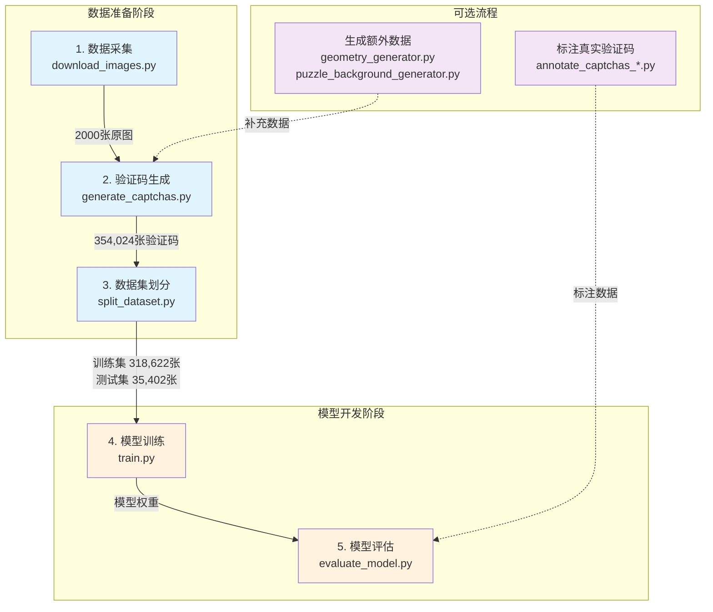

# 脚本使用指南

本目录包含了滑块验证码识别系统的核心功能脚本，涵盖数据采集、验证码生成、模型训练、推理评估等完整流程。

## 📁 目录结构

```
scripts/
├── download_images.py                     # 图片下载脚本
├── generate_captchas.py                   # 验证码批量生成脚本
├── split_dataset.py                       # 数据集划分脚本
│
├── annotation/                            # 📝 标注工具
│   ├── annotate_captchas_matplotlib.py    # Matplotlib标注界面
│   └── annotate_captchas_web.py           # Web标注界面
│
├── data_generation/                       # 🎨 数据生成
│   ├── geometry_generator.py              # 几何形状生成器
│   └── puzzle_background_generator.py     # 拼图背景生成器
│
├── evaluation/                            # 📊 模型评估
│   └── evaluate_model.py                  # 综合评估工具
│
├── inference/                             # 🚀 模型推理
│   └── predict.py                         # 预测接口
│
└── training/                              # 🏋️ 模型训练
    ├── train.py                           # 训练主脚本
    ├── dataset.py                         # PyTorch数据集类
    └── analyze_training.py                # 训练分析工具
```

## 📑 目录

1. [数据准备](#数据准备)
   
   - [download_images.py](#download_imagespy)
   - [generate_captchas.py](#generate_captchaspy)
   - [split_dataset.py](#split_datasetpy)

2. [标注工具](#标注工具)
   
   - [annotate_captchas_matplotlib.py](#annotate_captchas_matplotlibpy)
   - [annotate_captchas_web.py](#annotate_captchas_webpy)

3. [数据生成](#数据生成)
   
   - [geometry_generator.py](#geometry_generatorpy)
   - [puzzle_background_generator.py](#puzzle_background_generatorpy)

4. [模型训练](#模型训练)
   
   - [train.py](#trainpy)
   - [dataset.py](#datasetpy)
   - [analyze_training.py](#analyze_trainingpy)

5. [模型推理](#模型推理)
   
   - [predict.py](#predictpy)

6. [模型评估](#模型评估)
   
   - [evaluate_model.py](#evaluate_modelpy)

---

## 🔄 完整工作流程



### 快速开始

```bash
# 步骤1：下载原始图片（2000张）
python scripts/download_images.py

# 步骤2：生成验证码数据集（354,024张）
python scripts/generate_captchas.py

# 步骤3：划分训练/测试集（9:1）
python scripts/split_dataset.py

# 步骤4：训练模型
python scripts/training/train.py

# 步骤5：评估模型性能
python scripts/evaluation/evaluate_model.py --mode all
```

---

## 数据准备

### download_images.py

**功能**：从 Pixabay API 自动下载高质量图片作为验证码生成的背景图。

**使用示例**：

```bash
# 基础用法 - 使用默认配置下载所有类别
python scripts/download_images.py

# 注意：脚本会自动读取 configs/config.yaml 中的配置
# 无需命令行参数，所有设置通过配置文件控制
```

**输出目录结构**：

```
data/raw/
├── minecraft/          # 200张 Minecraft 风格图片
├── Pixel_Food/         # 200张像素食物图片
├── Block_Public_Square/# 200张方块公共广场图片
├── backgrounds/        # 200张背景图片
├── buildings/          # 200张建筑图片
├── nature/            # 200张自然风景图片
├── Anime_Cityscape/   # 200张动漫城市景观
├── Abstract_Geometric_Art/ # 200张抽象几何艺术
└── ...                # 其他类别
```

**配置说明**（通过 config.yaml 控制）：

- **categories**: 10个预设图片类别
- **images_per_category**: 每类别下载数量（默认200）
- **concurrent_downloads**: 并发下载数（默认2，避免触发限制）
- **download_timeout**: 单张图片下载超时（默认30秒）
- **max_retries**: 失败重试次数（默认3次）

**日志文件**：

- `logs/data_collection.log` - 详细的下载日志，包含错误信息

**注意事项**：

- 需要有效的 Pixabay API key（在config.yaml配置文件中设置）

### generate_captchas.py

**功能**：批量生成滑块验证码数据集，将原始图片转换为带有拼图缺口和滑块的验证码图片，支持多进程并行处理。包含多种安全增强特性：缺口旋转、柏林噪声、混淆缺口、高光效果等。

**使用示例**：

```bash
# 基础用法 - 处理所有原始图片
python scripts/generate_captchas.py

# 限制处理数量（用于测试）
python scripts/generate_captchas.py --max-images 10

# 指定工作进程数
python scripts/generate_captchas.py --workers 4

# 只处理特定子目录
python scripts/generate_captchas.py --subdirs minecraft nature

# 自定义输入输出路径
python scripts/generate_captchas.py --input-dir data/my_images --output-dir data/my_captchas
```

**命令行参数**：

- `--input-dir`: 原始图片目录（默认：data/raw）
- `--output-dir`: 输出验证码目录（默认：data/captchas）
- `--workers`: 工作进程数（默认：自动检测，最多8个）
- `--max-images`: 最大处理图片数（默认：处理所有）
- `--subdirs`: 指定要处理的子目录（默认：处理所有）

**生成规则**：

- **拼图形状**：11种（5种四边组合 + 6种特殊形状）
- **拼图尺寸**：每张图片随机生成3个尺寸（40-70像素）
- **拼图位置**：4个随机位置，x轴必须大于70px（滑块宽度60px+10px）
- **滑块位置**：x坐标0-10px随机，y坐标与缺口对齐

**安全增强特性**：

1. **缺口旋转**（50%概率）：
   - 旋转角度：0.5-1.8度（正负随机）
   - 只旋转缺口，滑块保持不变
   - 提高机器识别难度

2. **柏林噪声**（50%概率）：
   - 应用于滑块表面
   - 噪声强度：40-80%随机
   - 模拟真实世界的纹理干扰

3. **混淆缺口**（60%概率）：
   - 生成与真实缺口相似的干扰缺口
   - 旋转角度：±10-30度
   - 与真实缺口至少相隔10像素
   - 不与滑块重叠

4. **缺口高光效果**（30%概率）：
   - 将传统的阴影效果改为高光效果
   - 混淆缺口与真实缺口保持一致效果
   - 增加视觉复杂度

**输出文件**：

- 验证码图片：`Pic{XXXX}_Bgx{X}Bgy{Y}_Sdx{X}Sdy{Y}_{hash}.png`
- 标注文件：`annotations.json` - 包含所有验证码的坐标信息和增强特性信息
- 统计文件：`generation_stats.json` - 生成统计和耗时

**标注文件格式**：

```json
{
    "filename": "Pic0001_Bgx120Bgy70_Sdx30Sdy70_hash.png",
    "bg_center": [120, 70],      // 缺口中心坐标
    "sd_center": [30, 70],       // 滑块中心坐标
    "shape": "(convex, flat, convex, concave)",
    "size": 60,
    "hash": "abcd1234",
    "rotation_angle": 1.2,       // 缺口旋转角度（度）
    "gap_highlighted": false,    // 是否使用高光效果
    "confusion_gap": {           // 混淆缺口信息（如果有）
        "position": [200, 90],   // 混淆缺口中心坐标
        "angle": -15.5,          // 混淆缺口旋转角度
        "size": [65, 65]         // 混淆缺口大小
    }
}
```

**性能说明**：

- 2000张原图约生成264,000个验证码（实际会生成354,024个）
- 输出文件总大小约1.5GB

### split_dataset.py

**功能**：将生成的验证码数据集按原图ID划分为训练集和测试集，确保同一原图的所有变体都在同一个集合中，避免数据泄露。

**使用示例**：

```bash
# 基础用法 - 按9:1划分，复制文件
python scripts/split_dataset.py

# 自定义划分比例（8:2）
python scripts/split_dataset.py --train-ratio 0.8

# 使用移动模式（更快，但会删除原文件）
python scripts/split_dataset.py --move

# 指定工作进程数
python scripts/split_dataset.py --workers 16

# 自定义路径
python scripts/split_dataset.py --captcha-dir data/my_captchas --train-dir data/my_train --test-dir data/my_test

# 设置随机种子（用于复现）
python scripts/split_dataset.py --seed 2024
```

**命令行参数**：

- `--captcha-dir`: 验证码源目录（默认：data/captchas）
- `--train-dir`: 训练集输出目录（默认：data/train）
- `--test-dir`: 测试集输出目录（默认：data/test）
- `--train-ratio`: 训练集比例（默认：0.9）
- `--seed`: 随机种子（默认：42）
- `--move`: 移动文件而非复制（大数据集推荐）
- `--workers`: 工作进程数（默认：自动检测）

**输出文件**：

- `data/train/` - 训练集图片和annotations.json
- `data/test/` - 测试集图片和annotations.json
- `data/dataset_split_stats.json` - 划分统计信息

**数据泄露检查**：
脚本会自动验证训练集和测试集的Pic ID没有重叠，确保：

- 同一张原图的所有132个变体都在同一个集合
- 模型评估的公正性和可靠性

---

## 标注工具

### annotation/annotate_captchas_matplotlib.py

**功能**：基于 Matplotlib 的验证码标注工具，用于手动标注真实验证码的滑块和缺口位置，支持在 Spyder 等 Python 环境中运行。

**使用示例**：

```bash
# 基础用法 - 标注默认目录的图片
python scripts/annotation/annotate_captchas_matplotlib.py

# 指定输入输出目录
python scripts/annotation/annotate_captchas_matplotlib.py --input data/my_captchas --output data/my_annotations

# 限制标注数量（默认100张）
python scripts/annotation/annotate_captchas_matplotlib.py --max 50

# 完整示例
python scripts/annotation/annotate_captchas_matplotlib.py \
    --input data/real_captchas/merged/site1 \
    --output data/real_captchas/annotated \
    --max 200
```

**命令行参数**：

- `--input`: 输入图片目录（默认：data/real_captchas/merged/site1）
- `--output`: 输出标注目录（默认：data/real_captchas/annotated）
- `--max`: 最大标注数量（默认：100）

**操作流程**：

1. 程序显示图片，等待用户点击
2. 第一次点击：标记滑块中心（红色圆圈+S）
3. 第二次点击：标记缺口中心（蓝色圆圈+G）
4. 点击 Save 保存并进入下一张
5. 点击 Skip 跳过当前图片
6. 点击 Reset 清除当前标记重新开始

**输出文件**：

- 标注图片：`Pic{XXXX}_Bgx{X}Bgy{Y}_Sdx{X}Sdy{Y}_{hash}.png`
- 标注文件：`annotations.json` - 包含所有标注的坐标信息

**注意事项**：

- 需要 matplotlib 图形界面支持（不适合纯终端环境）
- 标注顺序固定：先滑块（红）后缺口（蓝）
- 文件名中 Bg 代表缺口（Gap），Sd 代表滑块（Slider）

### annotation/annotate_captchas_web.py

**功能**：基于 Flask 的 Web 验证码标注工具，通过浏览器界面进行标注，支持快捷键操作，更适合大批量标注任务。

**核心特性**：

- Web 界面，任何浏览器都可使用
- 支持鼠标点击和键盘快捷键操作
- 实时显示标注进度和坐标信息
- 红色标记滑块（S），蓝色标记缺口（G）
- 自动保存标注结果，支持断点续标
- 响应式设计，界面美观易用

**使用示例**：

```bash
# 基础用法 - 启动 Web 服务器
python scripts/annotation/annotate_captchas_web.py

# 启动后在浏览器打开 http://localhost:5000

# 注意：需要先修改脚本中的路径配置：
# INPUT_DIR = Path("../../data/real_captchas/merged/site1")
# OUTPUT_DIR = Path("../../data/real_captchas/annotated")
# MAX_IMAGES = 100
```

**快捷键操作**：

- **空格键**：保存并进入下一张（需要标注完成）
- **R 键**：重置当前标注
- **S 键**：跳过当前图片

**操作流程**：

1. 运行脚本，启动 Flask 服务器
2. 在浏览器打开 http://localhost:5000
3. 点击图片标记滑块位置（红色）
4. 再次点击标记缺口位置（蓝色）
5. 按空格键或点击"Save & Next"保存
6. 重复直到完成所有图片

**输出文件**：

- 标注图片：`Pic{XXXX}_Bgx{X}Bgy{Y}_Sdx{X}Sdy{Y}_{hash}.png`
- 标注文件：`annotations.json`
- 支持下载：访问 `/download_annotations` 下载JSON文件

---

## 数据生成

### data_generation/geometry_generator.py

**功能**：生成密集的几何图案背景图，用于增加验证码数据集的多样性与训练模型的抗混淆能力。支持深色和白色背景，包含超过1500个几何元素的复杂图案。

**使用示例**：

```bash
# 生成单张图片并预览
python scripts/data_generation/geometry_generator.py --single

# 批量生成200张图片（默认深色背景）
python scripts/data_generation/geometry_generator.py

# 生成100张白色背景图片
python scripts/data_generation/geometry_generator.py --count 100 --white-bg

# 使用8个进程生成500张
python scripts/data_generation/geometry_generator.py --count 500 --workers 8

# 顺序模式（用于调试或Windows问题）
python scripts/data_generation/geometry_generator.py --sequential

# 自定义输出目录
python scripts/data_generation/geometry_generator.py --output data/my_patterns
```

**命令行参数**：

- `--count`: 生成图片数量（默认：200）
- `--output`: 输出目录（默认：data/raw/Geometric_Generated）
- `--single`: 生成单张图片并尝试预览
- `--workers`: 工作进程数（默认：自动检测）
- `--sequential`: 使用顺序模式而非多进程
- `--white-bg`: 生成白色背景（默认深色背景）

**输出目录**：

- 深色背景：`data/raw/Geometric_Generated/`
- 白色背景：`data/raw/Geometric_Generated_white/`

**图案组成**：

1. **贝塞尔网络**：60个节点的连接网络
2. **螺旋线**：35个不同大小的螺旋
3. **大型图形**：55个作为背景层
4. **中型图形**：8×6网格，每格3-5个
5. **小型图形**：300个填充空隙
6. **微小装饰**：800个点状元素

**性能说明**：

- 单张生成时间：~1秒         （AMD 9950X）

### data_generation/puzzle_background_generator.py

**功能**：生成白底复杂拼图图案背景，用于增加验证码数据集的多样性与训练模型的抗混淆能力。使用 81 种标准拼图形状和 12 种特殊形状组合，并包含真实的光照渲染效果。

**核心特性**：

- 生成320×160分辨率的拼图背景图案
- 81种标准拼图边缘组合 + 12种特殊形状（圆形、心形、星形、月牙等）
- 智能放置算法，确保拼图块之间不重叠
- 真实的3D光照效果（缺口阴影、滑块高光）
- 多尺寸拼图块（15-70像素）动态组合

**使用示例**：

```bash
# 预览单张效果
python scripts/data_generation/puzzle_background_generator.py --preview

# 批量生成400张（默认）
python scripts/data_generation/puzzle_background_generator.py

# 生成200张，使用8个进程
python scripts/data_generation/puzzle_background_generator.py --count 200 --workers 8

# 自定义输出目录
python scripts/data_generation/puzzle_background_generator.py --output data/my_puzzles

# Windows下使用顺序模式（避免多进程问题）
python scripts/data_generation/puzzle_background_generator.py --workers 1
```

**命令行参数**：

- `--count`: 生成图片数量（默认：400）
- `--output`: 输出目录（默认：data/raw/Puzzle_Backgrounds）
- `--workers`: 工作进程数（默认：自动检测）
- `--preview`: 生成并预览单张图片

**输出文件**：

- 文件名格式：`puzzle_bg_{XXXX}_{timestamp}.png`
- 输出目录：`data/raw/Puzzle_Backgrounds/`

**拼图组成**：

1. **初始大形状**：12-18个大尺寸拼图（55-70px）作为基础
2. **中等填充**：动态选择中等尺寸（35-55px）填充主要空间
3. **细节填充**：小尺寸拼图（15-35px）填充剩余空隙
4. **光照效果**：
   - 滑块效果：边缘高光(60-100)、方向性高光(30-50)
   - 缺口效果：基础阴影(30)、边缘阴影(50)、方向性阴影(25)

---

## 模型训练

### training/train.py

**功能**：滑块验证码检测模型的训练主脚本，实现了基于CenterNet架构的完整训练流程，支持分布式训练、混合精度训练和资源监控。

**使用示例**：

```bash
# 使用默认配置训练
python scripts/training/train.py

# 使用自定义配置文件
python scripts/training/train.py --config configs/my_train_config.yaml

# 从检查点恢复训练
python scripts/training/train.py --resume checkpoints/latest_checkpoint.pth

# Windows下推荐设置（避免共享内存问题）
python scripts/training/train.py --config configs/train_config_windows.yaml
```

**配置文件参数**：
训练配置文件已创建在 `configs/` 目录下：

- `configs/train_config.yaml` - 标准配置文件

```yaml
# configs/train_config.yaml 示例
data_dir: data                    # 数据目录
output_dir: checkpoints          # 输出目录
batch_size: 512                  # 批量大小（Windows建议256）
num_workers: 12                  # 数据加载进程数（根据CPU数量调整）
epochs: 20                       # 训练轮数
lr: 0.001                        # 初始学习率
weight_decay: 0.0001            # 权重衰减
reg_weight: 1.0                 # 偏移量损失权重
gaussian_radius: 3              # 高斯核半径
pretrained_weights: null        # 预训练权重路径（可选）
```

**输出文件**：

- `checkpoints/latest_checkpoint.pth` - 最新检查点
- `checkpoints/best_model.pth` - 最佳模型
- `checkpoints/checkpoint_epoch_XXXX.pth` - 每轮检查点
- `checkpoints/logs/` - TensorBoard日志
- `checkpoints/training_log_YYYYMMDD_HHMMSS.txt` - 训练日志

**训练过程**：

1. **数据预处理**：图像归一化、数据增强（亮度/对比度/噪声/模糊）
2. **热力图生成**：使用高斯核在目标中心生成峰值
3. **损失计算**：
   - Focal Loss (α=2, β=4) 用于热力图
   - L1 Loss 用于偏移量回归
4. **优化策略**：
   - AdamW优化器
   - OneCycleLR调度器（10%预热，余弦退火）
   - 梯度裁剪（max_norm=1.0）

**监控指标**：

- 训练/验证损失（总损失、热力图损失、回归损失）
- MAE（平均绝对误差，像素单位）
- 学习率变化
- GPU利用率、显存占用、功耗
- CPU和内存使用率

**性能参考**：

- ~6分钟/epoch（batch_size=512） （RTX 5090）
- 20 epochs总训练时间：1-2小时   （RTX 5090）

### training/dataset.py

**功能**：PyTorch数据集类，用于加载和预处理滑块验证码数据。设计为独立模块以解决Windows多进程pickle问题。

**使用示例**：

```python
from dataset import OptimizedCaptchaDataset
import albumentations as A
from albumentations.pytorch import ToTensorV2

# 定义数据增强
transform = A.Compose([
    A.RandomBrightnessContrast(p=0.5),
    A.GaussNoise(p=0.3),
    A.Normalize(mean=[0.485, 0.456, 0.406], std=[0.229, 0.224, 0.225]),
    ToTensorV2()
])

# 创建数据集
dataset = OptimizedCaptchaDataset(
    data_dir='data',
    annotations_file='data/train/annotations.json',
    split='train',
    transform=transform
)

# 在DataLoader中使用
from torch.utils.data import DataLoader
dataloader = DataLoader(
    dataset, 
    batch_size=32, 
    shuffle=True, 
    num_workers=4
)
```

**数据格式要求**：
annotations.json 格式：

```json
[
  {
    "filename": "Pic0001_Bgx120Bgy70_Sdx30Sdy70_hash.png",
    "bg_center": [120, 70],      // 缺口中心坐标
    "sd_center": [30, 70],       // 滑块中心坐标
    "shape": "puzzle_0012",      // 形状类型
    "size": 60                   // 拼图大小
  }
]
```

**类方法说明**：

- `__init__`: 初始化数据集，加载标注文件
- `__len__`: 返回数据集大小
- `__getitem__`: 获取单个样本，返回字典格式

**返回数据格式**：

```python
{
    'image': tensor,           # 图像张量 (C, H, W)
    'bg_center': array,       # 缺口中心 [x, y]
    'slider_center': array,   # 滑块中心 [x, y]
    'filename': str          # 文件名
}
```

### training/analyze_training.py

**功能**：分析训练日志，提取关键指标并可视化训练过程，帮助找出最优的模型检查点。

**使用示例**：

```bash
# 分析默认checkpoints目录的训练日志
python scripts/training/analyze_training.py

# 分析指定目录的训练日志
python scripts/training/analyze_training.py --checkpoint_dir path/to/checkpoints
```

**日志解析功能**：

- 支持标准格式的训练日志（training_log_*.txt）
- 提取信息：
  - 训练轮数（Epoch）
  - 训练损失（Train Loss）
  - 验证损失（Val Loss）
  - 平均绝对误差（MAE）

**生成的可视化**：

1. **训练/验证损失曲线**：对比训练集和验证集损失变化
2. **MAE曲线**：显示模型精度提升过程
3. **验证损失曲线**：单独显示验证损失趋势

**输出文件**：

- `logs/training_curves.png` - 训练曲线图

---

## 模型推理

### inference/predict.py

**功能**：滑块验证码预测接口，用于调用训练好的模型进行推理，支持单张图片预测、批量预测和可视化。

**使用示例**：

```bash
# 基础预测
python scripts/inference/predict.py --model checkpoints/best_model.pth --image test.png

# 调整热力图阈值（降低误检）
python scripts/inference/predict.py --model checkpoints/best_model.pth --image test.png --threshold 0.3

# 可视化预测结果
python scripts/inference/predict.py --model checkpoints/best_model.pth --image test.png --visualize

# 保存可视化结果
python scripts/inference/predict.py --model checkpoints/best_model.pth --image test.png --save-vis result.png

# 显示热力图分析
python scripts/inference/predict.py --model checkpoints/best_model.pth --image test.png --show-heatmap

# 指定运行设备
python scripts/inference/predict.py --model checkpoints/best_model.pth --image test.png --device cuda
```

**命令行参数**：

- `--model`: 模型权重文件路径（必需）
- `--image`: 输入图像路径（必需）
- `--threshold`: 热力图阈值（默认：0.1）
- `--visualize`: 显示可视化结果
- `--save-vis`: 保存可视化结果的路径
- `--show-heatmap`: 显示详细的热力图分析
- `--device`: 运行设备（auto/cuda/cpu）

**输出格式**：

```json
{
  "gap_center": [120.5, 80.2],         // 缺口中心坐标
  "slider_center": [30.8, 80.5],       // 滑块中心坐标
  "gap_confidence": 0.9876,            // 缺口检测置信度
  "slider_confidence": 0.9654,         // 滑块检测置信度
  "sliding_distance": 89.7             // 滑动距离（像素）
}
```

**API使用示例**：

```python
from predict import CaptchaPredictor

# 创建预测器
predictor = CaptchaPredictor(
    model_path='checkpoints/best_model.pth',
    device='cuda',
    hm_threshold=0.1
)

# 预测单张图片
result = predictor.predict('captcha.png')
print(f"滑动距离: {result['gap_x'] - result['slider_x']:.1f}px")

# 可视化结果
predictor.visualize_prediction('captcha.png', save_path='result.png')

# 显示热力图
predictor.visualize_heatmaps('captcha.png', show=True)
```

**可视化功能**：

1. **检测结果可视化**：
   
   - 红色圆圈：缺口中心位置
   - 蓝色圆圈：滑块中心位置
   - 绿色虚线：滑动路径
   - 标注框：显示坐标和置信度

2. **热力图可视化**（4子图）：
   
   - 原始图像
   - 缺口热力图叠加
   - 滑块热力图叠加
   - 组合热力图

**性能参考**：

- CPU推理：5ms/张（AMD9950X）
- GPU推理：1ms/张（RTX 5090）
- 内存占用：~200MB（模型加载）

**阈值调整建议**：

- 默认0.1：适合大多数场景
- 0.0-0.05：提高召回率，可能增加误检
- 0.2-0.3：提高精确率，可能漏检弱目标

---

## 模型评估

### evaluation/evaluate_model.py

**功能**：综合模型评估工具，提供多维度的模型性能分析，包括最优模型评估、训练过程分析和详细的可视化报告。

**使用示例**：

```bash
# 评估最优模型（默认模式）
python scripts/evaluation/evaluate_model.py --mode best

# 分析训练过程中的准确率变化
python scripts/evaluation/evaluate_model.py --mode training

# 执行所有评估（最优模型+训练分析）
python scripts/evaluation/evaluate_model.py --mode all
```

**评估模式说明**：

1. **最优模型评估（--mode best）**：
   
   - 评估测试集（1000个样本）
   - 评估真实验证码数据集（全部样本）
   - 生成100+张可视化对比图
   - 计算详细的性能指标

2. **训练过程分析（--mode training）**：
   
   - 分析每个epoch的模型性能
   - 对比测试集和真实数据集表现
   - 生成准确率变化曲线图
   - 找出最佳epoch

**评估指标**：

- **检测率**：成功检测到目标的比例
- **MAE（平均绝对误差）**：仅计算X轴误差
- **成功率@5px**：误差≤5像素的比例
- **成功率@7px**：误差≤7像素的比例
- **基于距离的成功率**：滑动距离误差的准确率

**输出文件结构**：

```
results/
├── best_model_evaluation/
│   ├── test_dataset/
│   │   ├── visualizations/     # 100张可视化图
│   │   └── evaluation_results.json
│   ├── real_captchas/
│   │   ├── visualizations/     # 50张可视化图
│   │   └── evaluation_results.json
│   └── summary_report.json     # 汇总报告
│
logs/
├── accuracy_comparison.png      # 准确率对比图
├── training_accuracy_results.csv # 详细数据表
└── evaluation_*.log            # 评估日志
```

**可视化说明**：

- 绿色实线圆：真实位置（Ground Truth）
- 红色虚线圆：预测的缺口位置
- 蓝色虚线圆：预测的滑块位置
- 紫色虚线：滑动路径
- 标注框：显示MAE和置信度

**评估报告示例**：

```json
{
  "dataset_name": "Test Dataset",
  "total_samples": 1000,
  "gap_detection_rate": 99.8,
  "gap_mean_mae": 1.23,
  "gap_success_rate_5px": 96.5,
  "gap_success_rate_7px": 98.2,
  "both_success_rate_5px": 95.8,
  "both_success_rate_7px": 97.6
}
```

---

## 🔧 通用说明

1. **环境要求**：
   
   - Python 3.8+
   - PyTorch 2.0+
   - CUDA 11.8+（可选，用于GPU训练/推理）
   - 详见 `requirements.txt`

2. **数据路径约定**：
   
   - 原始图片：`data/raw/`
   - 生成的验证码：`data/captchas/`
   - 训练集：`data/train/`
   - 测试集：`data/test/`
   - 真实验证码：`data/real_captchas/`

3. **模型保存路径**：
   
   - 检查点：`checkpoints/`
   - 最佳模型：`checkpoints/best_model.pth`
   - 训练日志：`logs/`